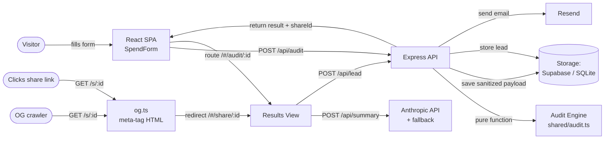

# ARCHITECTURE.md

## What it is

SpendScope is a free, no-login web app that audits a team's AI-tool spend: the user enters their stack (tools, plans, monthly spend, seats, team size, use case) and gets an instant per-tool breakdown of overspending, cheaper alternatives, and total potential savings — plus a shareable public URL with Open Graph previews.

## System diagram

## Data flow: input → audit result

1. **Input.** `SpendForm` (client) collects team size, primary use case, and one entry per tool: toolId, planId, monthly spend, seats. State persists to `localStorage` via `usePersistentState`, so a reload never loses progress.
2. **Compute.** On submit, `POST /api/audit` passes the input to `audit()` in `shared/audit.ts` — a pure, deterministic, dependency-free function (hardcoded rules, **no AI**). It returns a per-tool recommendation list plus total monthly/annual savings and a savings tier (`high` >$500/mo, `medium` $100–500, `low` <$100, `optimal` $0).
3. **Persist (PII-stripped).** The server saves a *sanitized* payload under a random `shareId` — tool names, plan names, spend and savings only. Email and company are never stored on the public record. Returns `{ result, shareId }`.
4. **Render.** The client routes to `/#/audit/:shareId`, reads the result from a `localStorage` cache (instant) and/or `GET /api/audits/:shareId` (canonical), and renders `AuditResultsView`: hero savings, per-tool breakdown cards, AI summary, lead form, share link.
5. **Summarize.** `POST /api/summary` calls the Anthropic API with the engine's numbers; on any failure (no key, timeout, 429) it returns a deterministic templated fallback built from the same data.
6. **Capture.** `POST /api/lead` stores the lead (email + optional company/role), protected by a honeypot field and a per-IP rate limiter, then sends a transactional confirmation email via Resend (skipped gracefully if Resend isn't configured).
7. **Share.** The public URL `/s/:shareId` is served by `og.ts` as **real HTML with populated OG/Twitter meta tags** (not the SPA shell), so link-preview crawlers see the savings headline. A human clicker is redirected into the app at `/#/share/:shareId` for the interactive, PII-free view.

## Why this stack

- **Express + Vite + React + TypeScript + Tailwind + shadcn/ui.** TypeScript end-to-end lets the `AuditInput`/`AuditResult` types flow from the engine into the API contract into the UI with compile-time safety — critical when "every number must trace to a source." Tailwind + shadcn give a polished, accessible, Lighthouse-friendly UI without a prebuilt admin template (forbidden by the brief).
- **One server, one port.** Express serves both the API and the built SPA, so a single deploy unit handles everything. Simpler than a split front/back deploy and good enough for the traffic profile.
- **Pluggable storage (`IStorage`).** Supabase in production (Postgres, free tier, survives restarts); SQLite locally (zero-config dev); in-memory as a last-resort fallback so the demo *never* breaks. The rest of the app is backend-agnostic.
- **OG via a dedicated HTML route, not the SPA.** Crawlers don't run JS, so `/s/:id` returns pre-rendered meta-tag HTML. The SPA at `/#/share/:id` is for humans.

## Why not AI for the audit?

The audit math is hardcoded rules on purpose. Pricing is volatile and must trace to a cited URL; an LLM would hallucinate plan prices and alternatives (I tried — see `PROMPTS.md`). Rules are deterministic, testable (11 tests in `tests/audit.test.ts`), and defensible to a finance person. AI is used only for the one thing it's genuinely good at here: turning structured numbers into a readable 100-word note.

## If it had to handle 10k audits/day

The current single Express process comfortably handles a few hundred req/s of audit computes (the engine is pure CPU, ~µs). At 10k/day (~0.12 req/s average, ~50 req/s peak) the bottlenecks would be:

1. **Stateless API tier.** Move Express behind a horizontal scaler (Fly.io machines or Render services). Audit compute is stateless and embarrassingly parallel — just add instances. No shared in-memory state except the rate-limiter map, which moves to Redis (`@upstash/redis` with a sliding-window script).
2. **Storage.** Supabase already scales Postgres; add a read replica and a covering index on `audits.share_id` (already unique). The `leads` table gets a daily partition. Move the lead email send to a queue (the route acks immediately; a worker sends via Resend) so a Resend blip never blocks a 200.
3. **AI summary.** The Anthropic call is the slowest, most expensive step. Cache summaries by a hash of the audit result (identical stacks produce identical summaries), cap concurrency, and fall back to the template faster (2s timeout) under load. Consider streaming the summary so the rest of the page renders first.
4. **OG renders.** `/s/:id` reads the DB on every crawl; add a short CDN edge cache (Vercel/Cloudflare) keyed by `shareId` — audits are immutable once created.
5. **Observability.** Instrument `/api/audit`, `/api/summary`, `/api/lead` with p95 latency + error-rate dashboards; alert on summary-fallback rate climbing (signals Anthropic degradation).
