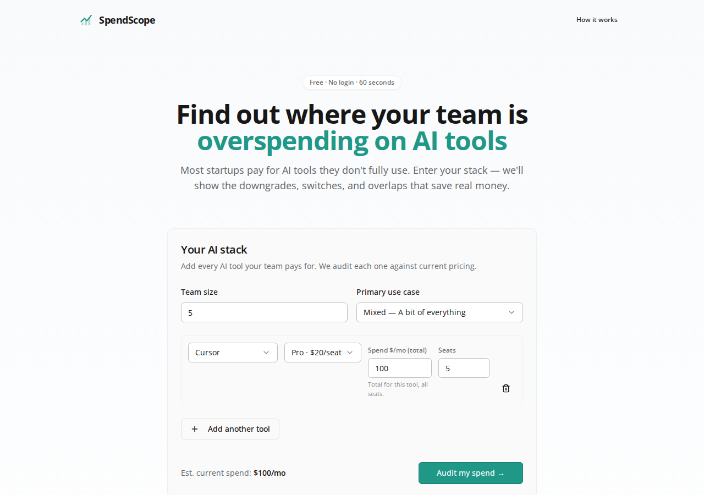
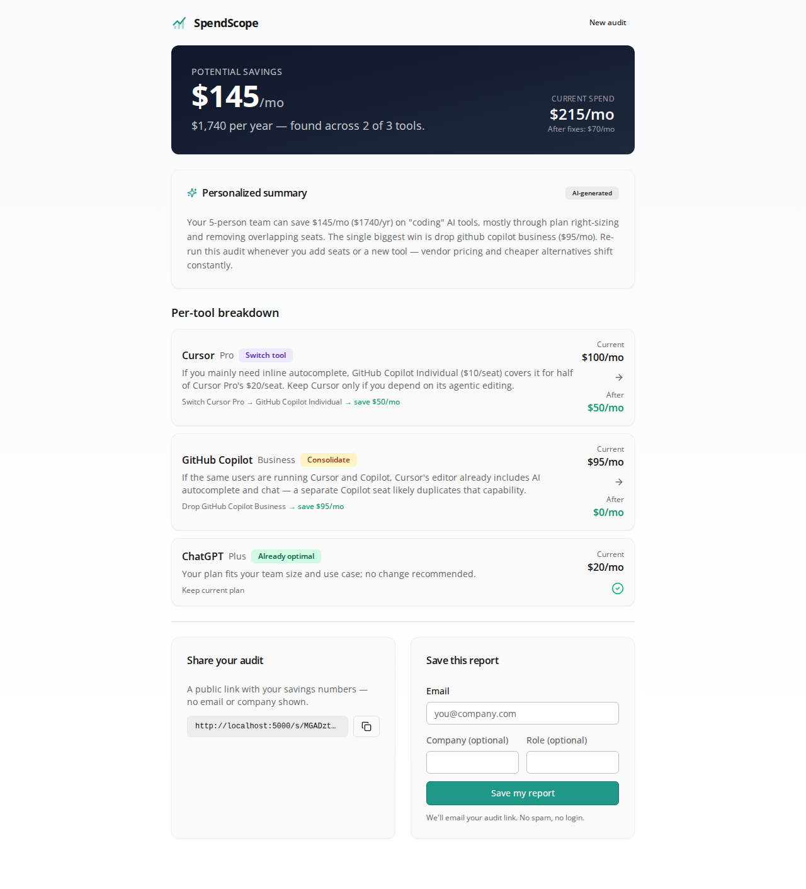
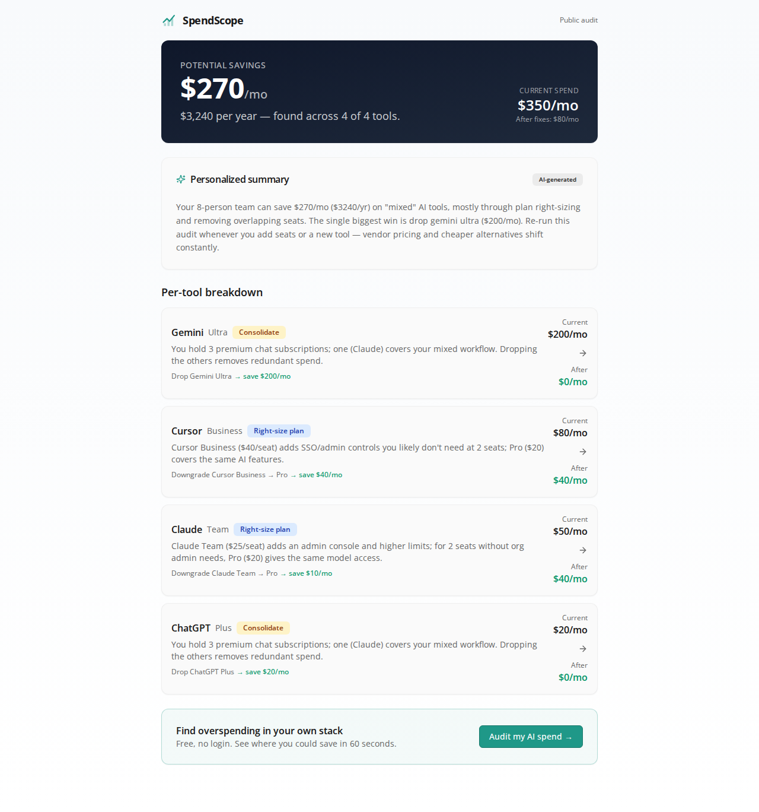
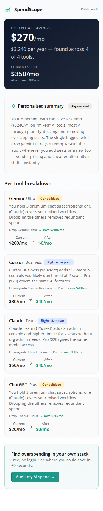

# SpendScope — AI Spend Audit

A free, no-login web app that shows startups where they're overspending on AI tools. Enter your stack (Cursor, GitHub Copilot, Claude, ChatGPT, Anthropic/OpenAI API, Gemini, Windsurf) and get an instant per-tool audit: plan right-sizing, cheaper alternatives, overlapping tools to consolidate, and total potential monthly + annual savings — plus a shareable public URL with Open Graph previews.

Built for the Techvruk web development assessment. **Who it's for:** a founder, ops lead, or eng manager who pays the AI-tool bill and wants a second opinion before paying it.

## Screenshots

| Landing | Audit results |
| --- | --- |
|  |  |

| Public share (desktop) | Public share (mobile) |
| --- | --- |
|  |  |

## Quick start

```bash
npm install
npm run dev      # http://localhost:5000
```

### Run tests / lint / typecheck

```bash
npm test         # vitest — audit engine (11 tests)
npm run lint     # eslint
npm run check     # tsc --noEmit
```

### Build & run production

```bash
npm run build    # builds client (dist/public) + server (dist/index.cjs)
npm start        # NODE_ENV=production node dist/index.cjs
```

## Environment variables

Copy `.env.example` to `.env`. **All are optional** — the app runs and demos fully without them (SQLite + in-memory fallbacks + templated AI summary). Configure them for the production-grade features:

| Var | Purpose |
| --- | --- |
| `ANTHROPIC_API_KEY` | AI-personalized summary (falls back to a template if unset) |
| `SUPABASE_URL` + `SUPABASE_SERVICE_ROLE_KEY` | Production lead/audit storage (Postgres). Falls back to local SQLite. |
| `RESEND_API_KEY` + `MAIL_FROM` | Transactional confirmation email (skipped if unset) |
| `APP_URL` | Canonical origin for OG/share URLs (e.g. `https://yourapp.vercel.app`) |

### Supabase schema (one-time)

Run in the Supabase SQL editor:

```sql
create table audits (
  share_id text primary key,
  payload jsonb not null,
  created_at timestamptz default now()
);
create table leads (
  id bigint generated always as identity primary key,
  email text not null,
  company text, role text, team_size int, share_id text, audit_snapshot jsonb,
  created_at timestamptz default now()
);
alter table leads enable row level security;
```

## Deploy

The app is a single Express server serving the API + built SPA. Recommended free-tier hosts (any "equivalent" from the brief):

- **Render** — create a Web Service from your GitHub repo, build `npm run build`, start `npm start`, add the env vars above. SQLite writes to the ephemeral disk in dev; for persistence configure Supabase.
- **Fly.io** — `fly launch` (detects Node), `fly deploy`. Mount a volume if keeping SQLite, or use Supabase.

Live URL (add yours after deploy): _<https://your-app.onrender.com>_

## Decisions (5 trade-offs)

1. **Hardcoded rules for the audit math, AI only for the summary.** An LLM hallucinates plan prices and invents cheaper alternatives that don't exist; rules are deterministic, testable, and every number traces to `PRICING_DATA.md`. Cost: the rules need manual updates as pricing changes — accepted, because accuracy is the product.
2. **Express + SPA in one deploy unit over a split Next.js/Vercel setup.** One server, one port, simpler ops and a single free-tier service. Trade-off: OG link previews need a dedicated HTML route (`/s/:id` in `og.ts`) instead of Next's `generateMetadata` — a few extra lines, same result.
3. **Pluggable storage with graceful fallback (Supabase → SQLite → in-memory).** The app must demo even with zero configuration. Trade-off: three storage code paths to maintain — worth it because a broken demo is an automatic reject and the fallbacks are thin.
4. **Honeypot + per-IP rate limit over hCaptcha.** No third-party script, no privacy/UX cost, no dependency on a captcha vendor's uptime. Trade-off: a determined distributed attacker could still spam — acceptable for a free lead form; a real launch would add hCaptcha behind the same `rateLimited()` guard.
5. **Email captured strictly after value is shown.** The audit + shareable URL are free and login-free; the email gate sits *after* the results. Trade-off: fewer leads than a forced upfront gate — but the brief is explicit ("email after value, never before") and the higher-quality leads convert better.

## Pricing accuracy

Every price is verified against the vendor's official pricing page on 2026-07-17 and cited in [`PRICING_DATA.md`](PRICING_DATA.md). Re-verify before each submission.
